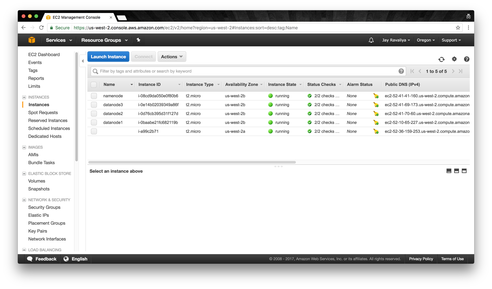
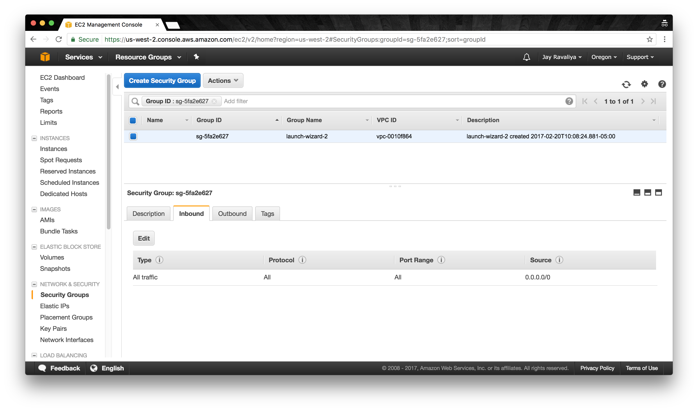
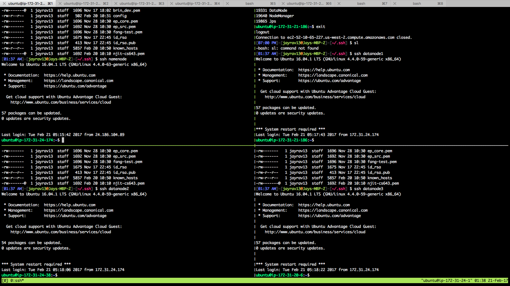
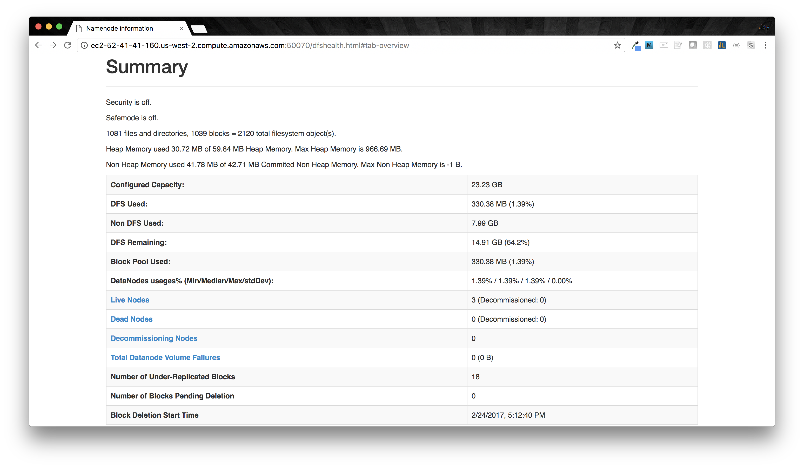
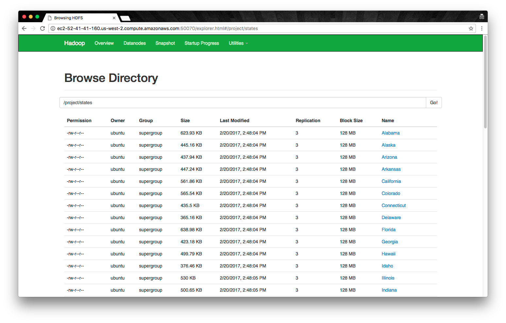

# Module 03 Assignment 03: Programming Assignment

- By Jay Ravaliya
- jhr3@njit.edu
- CS 643 - Cloud Computing

## Getting Started

The goal of this Programming Assignment is two fold:

1. Learn how to stand up a Hadoop Cluster in AWS using EC2 instances.
2. Write a MapReduce job in Java that uses this built cluster.

In this README, I will be discussing the steps I took to accomplish these tasks. Note - I took this opportunity to explore and use external sources for guidance and will be referencing them both 1. along the way and 2. formally at the end of this README.

### Amazon Machine Image

Here is the Hadoop AMI that was created using Ubuntu's AMI as a reference:

```json
{
	"ami-331a9b53": "ravaliya-namenode-hadoop-ami"
}
```

I also created an AMI from one of the three data nodes as a backup:

```json
{
	"ami-62199802": "ravaliya-datanode-hadoop-ami"
}
```

Both AMI's are publicly accessible.

## Deploying a Hadoop Cluster

### Launch EC2 Instances

My first task was to spin up four (4) micro EC2 instances - one would be used as a `namenode` (or `master` node) and three would be used as `datanodes` (or `worker` nodes).



Next, I set up the Security Group for these EC2 instances such that **ALL TRAFFIC** was permitted to enter. I did this simply because I wanted to get this project up and running, however recognize that this is not a production strategy that should be considered.



Finally, I created and downloaded a Key Pair, `njit-cs643.pem`, which I used to access all of these machines.

```bash
# Example

$ sudo chmod 0600 ~/.ssh/njit-cs643.pem
$ ssh -i ~/.ssh/njit-cs643.pem ubuntu@ec2-52-41-41-160.us-west-2.compute.amazonaws.com
```

### SSH and Authentication Configuration

In order to ensure that all machines could be seamlessly authenticated without needing passwords (which is especially important for the Hadoop Cluster), I stepped through the process of:

1. Setting up a `~/.ssh/config` on the `namenode` instance.
2. Creating an RSA key on `namenode` and specifying `authorized_keys` on all `datanodes`.

First, I wrote a `config` file:

```bash
# ~/.ssh/config

Host namenode
  HostName ec2-52-41-41-160.us-west-2.compute.amazonaws.com
  User ubuntu
  IdentityFile ~/.ssh/njit-cs643.pem
Host datanode1
  HostName ec2-52-10-65-227.us-west-2.compute.amazonaws.com
  User ubuntu
  IdentityFile ~/.ssh/njit-cs643.pem
Host datanode2
  HostName ec2-52-41-70-60.us-west-2.compute.amazonaws.com
  User ubuntu
  IdentityFile ~/.ssh/njit-cs643.pem
Host datanode3
  HostName ec2-52-41-69-173.us-west-2.compute.amazonaws.com
  User ubuntu
  IdentityFile ~/.ssh/njit-cs643.pem
``` 

Then, I created an RSA key that can be used on `namenode`:

```bash
$ ssh-keygen -f ~/.ssh/id_rsa -t rsa -P ""
$ cat ~/.ssh/id_rsa.pub >> ~/.ssh/authorized_keys
```

Finally, I transferred the public key to each of the `datanodes`:

```bash
$ cat ~/.ssh/id_rsa.pub | ssh datanode1 'cat >> ~/.ssh/authorized_keys'
$ cat ~/.ssh/id_rsa.pub | ssh datanode2 'cat >> ~/.ssh/authorized_keys'
$ cat ~/.ssh/id_rsa.pub | ssh datanode3 'cat >> ~/.ssh/authorized_keys'
```

This `~/.ssh/config` file with the `authorized_keys` strategy allows for full Passwordless SSH from `namenode` to all `datanodes`.

### Install Hadoop

On to the real deal! For this section, the guide<sup>[1]</sup> that I used recommended having all of the nodes open on a screen together so files across instances can be updated simultaneously. This suggestion was put forward instead of a strategy to create a single AMI and use it for all four instances. This was a misstep in my part, but I did end up provisioning all four instances manually, so will discuss as such:



First, we need to install Java. Here, I install **OpenJDK Runtime Environment**. Note that the guide<sup>[1]</sup> uses `1.7.0`. I used `1.8.0` instead:

```bash
$ sudo apt-get update
$ sudo apt-get install openjdk-8-jdk

$ java -version
openjdk version "1.8.0_121"
OpenJDK Runtime Environment (build 1.8.0_121-8u121-b13-0ubuntu1.16.04.2-b13)
OpenJDK 64-Bit Server VM (build 25.121-b13, mixed mode)
```

Next, installing Hadoop. Here I am using **Hadoop version 2.7.1**.

```bash
$ mkdir ~/Downloads
$ wget http://apache.mirrors.tds.net/hadoop/common/hadoop-2.7.1/hadoop-2.7.1.tar.gz -P ~/Downloads
$ sudo tar zxvf ~/Downloads/hadoop-* -C /usr/local
$ sudo mv /usr/local/hadoop-* /usr/local/hadoop
```

Next, we have to add a series of environment variables to the `~/.profile` file:

```bash
export JAVA_HOME=/usr/lib/jvm/java-8-openjdk-amd64
export PATH=$PATH:$JAVA_HOME/bin

export HADOOP_HOME=/usr/local/hadoop
export PATH=$PATH:$HADOOP_HOME/bin

export HADOOP_CONF_DIR=/usr/local/hadoop/etc/hadoop
```
Here, I deviate from the guide<sup>[1]</sup>, which uses `export JAVA_HOME=/usr`

These environment variables can be reloaded with `$ source ~/.profile`

### Hadoop Configurations

#### All Nodes

There are four key files that have to be updated across all nodes. Either portions of the file have to be edited or added. Let's look at each one individually:

```bash
# $HADOOP_CONF_DIR/hadoop-env.sh

export JAVA_HOME=/usr
```

```bash
# $HADOOP_CONF_DIR/core-site.xml

<configuration>
	<property>
		<name>fs.defaultFS</name>
		<value>hdfs://ec2-52-41-41-160.us-west-2.compute.amazonaws.com:9000</value>
	</property>
</configuration>
```

```bash
# $HADOOP_CONF_DIR/yarn-site.xml

<configuration>
	<property>
		<name>yarn.nodemanager.resource.memory-mb</name>
		<value>3096</value>
	</property>
	<property>
		<name>yarn.nodemanager.aux-services</name>
		<value>mapreduce_shuffle</value>
	</property>
	<property>
		<name>yarn.nodemanager.aux-services.mapreduce.shuffle.class</name>
		<value>org.apache.hadoop.mapred.ShuffleHandler</value>
	</property>
	<property>
		<name>yarn.resourcemanager.hostname</name>
		<value>ec2-52-41-41-160.us-west-2.compute.amazonaws.com</value>
	</property>
</configuration>
```
Here, I deviate from the guide<sup>[1]</sup> by adding the `yarn.nodemanager.resource.memory-mb` tag to throttle memory usage on each instance<sup>[3]</sup>. Beacuse micro instances only come with 1 GB of RAM, it was important that every instance not use the entire 8 GB hard drive for swap space and thus both abuse memory and impact the Operating System. After a bit of trial end error, I settled at 3 GB (3096 MB) for max memory resources as a suitable upper bound.

The specific error that led to this discovery: `Container killed on request. Exit code is 137`.

```bash
# $HADOOP_CONF_DIR/mapred-site.xml

<configuration>
	<property>
		<name>mapreduce.jobtracker.address</name>
		<value>ec2-52-41-41-160.us-west-2.compute.amazonaws.com:54311</value>
	</property>
	<property>
		<name>mapreduce.framework.name</name>
		<value>yarn</value>
	</property>
</configuration>
```

#### NameNode Specific

```bash
# $HADOOP_CONF_DIR/hdfs-site.xml

<configuration>
	<property>
		<name>dfs.replication</name>
		<value>3</value>
	</property>
	<property>
		<name>dfs.namenode.name.dir</name>
		<value>file:///usr/local/hadoop/hadoop_data/hdfs/namenode</value>
	</property>
</configuration>
```

Add the folder under `dfs.namenode.name.dir`:

```
$ sudo mkdir -p $HADOOP_HOME/hadoop_data/hdfs/namenode
```

Create the `master` (or `namenode`) and `slaves` (or `datanodes`) files:

```bash
$ sudo touch $HADOOP_CONF_DIR/masters
$ sudo touch $HADOOP_CONF_DIR/slaves
```

```bash
# $HADOOP_CONF_DIR/masters

ec2-52-41-41-160.us-west-2.compute.amazonaws.com
```

```bash
# $HADOOP_CONF_DIR/slaves

ec2-52-10-65-227.us-west-2.compute.amazonaws.com
ec2-52-41-70-60.us-west-2.compute.amazonaws.com
ec2-52-41-69-173.us-west-2.compute.amazonaws.com
```

Update permissions:

```bash
$ sudo chown -R ubuntu $HADOOP_HOME
```

#### DataNode Specific

```bash
# $HADOOP_CONF_DIR/hdfs-site.xml:

<configuration>
	<property>
		<name>dfs.replication</name>
		<value>3</value>
	</property>
	<property>
		<name>dfs.datanode.data.dir</name>
		<value>file:///usr/local/hadoop/hadoop_data/hdfs/datanode</value>
	</property>
</configuration>
```

```bash
# Create datanode folder from hdfs-site.xml
$ sudo mkdir -p $HADOOP_HOME/hadoop_data/hdfs/datanode

# Update permissions
$ sudo chown -R ubuntu $HADOOP_HOME
```

### Start / Launch Hadoop Cluster

```bash
# Format HDFS
$ hdfs namenode -format

# Start HDFS
$ $HADOOP_HOME/sbin/start-dfs.sh

# Start YARN
$ $HADOOP_HOME/sbin/start-yarn.sh

# Start All (deprecated)
$ $HADOOP_HOME/sbin/start-all.sh
```

At this point, we should have a `namenode` pointing at 3 `datanodes`! To confirm, we can visit Hadoop's Web UI and see the number of Live Nodes:



## MapReduce

### Data Migration to HDFS

Once I downloaded `states/` from `moodle.njit.edu`, I followed a two-step process to migrate the data to HDFS.

1. Copy this data from `local` to `namenode`.
2. Copy this data from `namenode` to `hdfs`.

Specifically:

```bash
(namenode) $ mkdir ~/states
(local)    $ scp -i ~/.ssh/njit-cs643.pem ~/Downloads/states/* namenode:~/states/.
(namenode) $ hdfs dfs -mkdir /project/states
(namenode) $ hdfs dfs -copyFromLocal ~/states/* /projects/states/.
```

This resulted in all of this data being available to me in HDFS:



### Source Code and Directories

The Source Code for this assignment is available under `src/`. For each submission [`ProblemOne/`, `ProblemTwo/`]:

- The code specifically is in the root directory's `*.java` file.
- The primary output is `FINAL.txt` in the `output/` folder.
- The `helpers/` folder contains a `*.sh` script that I used to clear this project's data and run it every time (on `namenode`).

I used Apache's Hadoop Tutorial <sup>[2]</sup> as my starter code to build this out.

**NOTE**: For `ProblemOne`, the first part of this is available under `full_document_count.txt`.

### Issues

1. For both outputs, the sum of the counts consistently came out to 49, versus the expected 50, representing the 50 states as inputs. 
2. For `ProblemTwo`'s final step, the goal was to how many states have the same rank in descending order. However, my output shows this in ascending order. Unfortunately, I wasn't able to properly swap the order, however the output values still remain valid; the list is simply shown backwards.


## External Sources

<sup>[1]</sup> **Spinning Up a Free Hadoop Cluster: Step by Step** https://blog.insightdatascience.com/spinning-up-a-free-hadoop-cluster-step-by-step-c406d56bae42#.q6e3nwlt2

<sup>[2]</sup> **MapReduce Tutorial** http://hadoop.apache.org/docs/current/hadoop-mapreduce-client/hadoop-mapreduce-client-core/MapReduceTutorial.html

<sup>[3]</sup> **HOW TO PLAN AND CONFIGURE YARN AND MAPREDUCE 2 IN HDP 2.0** http://hortonworks.com/blog/how-to-plan-and-configure-yarn-in-hdp-2-0/